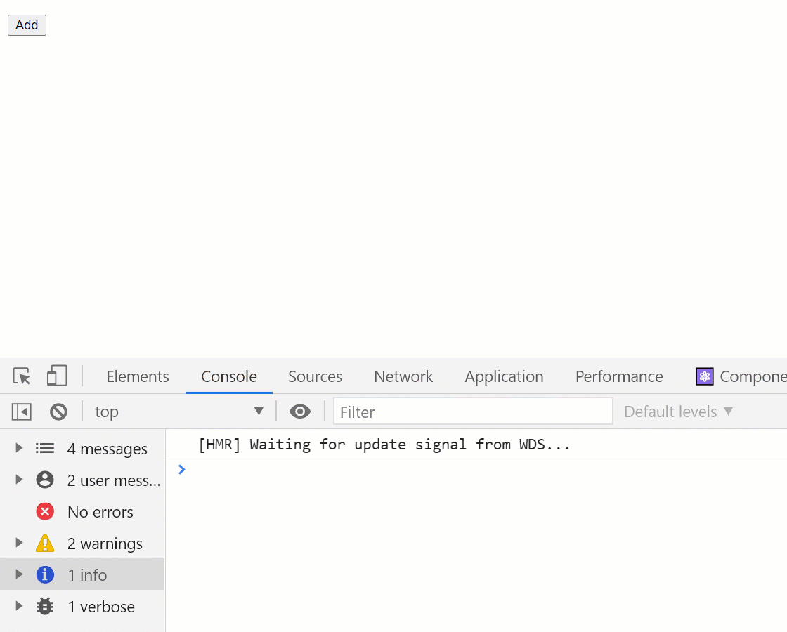

## Problem

#### Why, after creating a new task, adding an element's id to an array with already existing id's, all elements are re-rendered?

#### This does not happen when we change the status of a task, but it happens when it is deleted.

---



### The source of the problem is changing the composition of array elements with ids

```js
const todosIdsState = atom({
  key: 'todosIds',
  default: [],
})

...
 const [todosIds, setTodosIds] = useRecoilState(todosIdsState)
 ...

const deleteTodo = React.useCallback(
  function (id) {
    return function (e) {
      setTodosIds((prevIds) => {
        const index = prevIds.findIndex((currentId) => currentId === id)

        let newIds = [...prevIds]
        if (index >= 0) {
          newIds.splice(index, 1)
        }
        console.log(' deleteTodo - newIds: ', newIds)
        return newIds
      })
    }
  },
  [setTodosIds]
)
```
